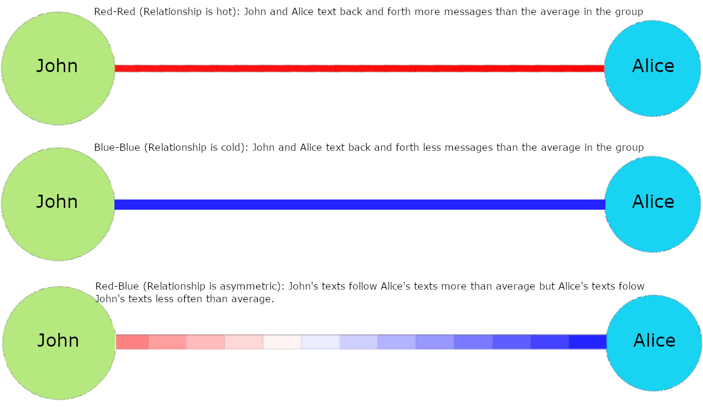

WhatsappAnalyzer is a simple Django web app prototype created for recreation purposes.
Check it out [here](https://whatsapp-chat-export-analyzer.herokuapp.com/).

It allows to upload a Whatsapp chat export file of a group chat ([video tutorial](https://www.youtube.com/watch?v=-Ald352nhao)) and draws a graph where each user is represented as a circle and the connection between them as a lines.

The area of each circle is proportional to the number of messages sent by the user.

The lines that go from once circle to another represent the _intensity_ of the communication between each user. The _intensity_ is calculated looking at the chat as a sequence of messages. The application counts how many messages from a given user are followed by messages of each of the rest of users.

The strong assumptions is that the more intense the relationship between two users, the more messages they send back and forth.

Then, the application compares the actual number of messages of _User A_ followed by messages of _User B_, with the expected number under the hypothesis that messages are just random (generated by a multinomial distribution https://en.wikipedia.org/wiki/Multinomial_distribution). The probability that a given message is written by a given user is estimated as the proportion of messages of that user (Maximum Likelihood Estimator for the Multinomial distribution).

If the actual number of back and forth messages is approximately the same as the expected one, the line that joins the circles of both users will be white.

If it is higher, it will be red (the relationship is _hot_).

If it is lower, it will be blue (the relationship is _cold_).

You can click on the circles to show them or disable them.

The next is an example with anonymous users:

The Whatsapp chat export file is deleted after it is processed, i.e. it is not stored.

Check out the prototype [here](https://whatsapp-chat-export-analyzer.herokuapp.com/).
It will take some seconds until the file is processed.
If you do not see anyting after a while, just refresh. It is just a minor bug.

Main packages used: Django, Pandas, Numpy, Plotly and Dash.
