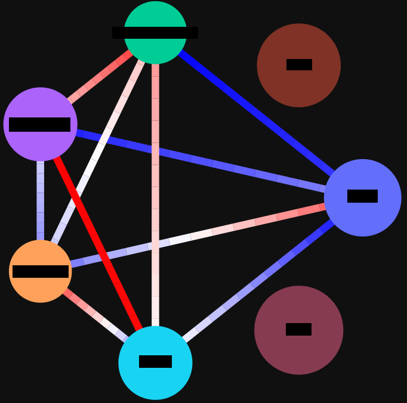

# Introduction

WhatsappAnalyzer is a web application that analyzes the intensity (warmth, closeness) of relationships between the members of a Whatsapp group.

It uses chat export files and anlyzes the order of messages (how many times a member responded after another member). The strong assumptions is that the more intense the relationship between two users, the more messages they send back and forth.

The results are represented visually as a network connected by red or blue links (warm or cold relationships).

The app is already prepared to be deployed as-is on the PaaS [Heroku](https://www.heroku.com/).

# Approach

It has been developed by using the Django framework as the web backend.

The visualizations use Python package Plotly and Dash.
The cleaning and processing of data relies heavily on Pandas and Numpy packages.

The analysis step models each chat as a Markov probabilistic process and uses linear algebra (eigendecomposition) to find the warmth coefficients. The application compares the actual number of messages of _User A_ followed by messages of _User B_, with the expected number under the hypothesis that messages are just random (generated by a multinomial distribution https://en.wikipedia.org/wiki/Multinomial_distribution). The probability that a given message is written by a given user is estimated as the proportion of messages of that user (Maximum Likelihood Estimator for the Multinomial distribution).

The deployment has been done in Heroku.

# Conclusions

The main lessons learned during the development of this app are:
- Use loosely coupled architecture to be able to deploy the app in different platforms seamlessly. Fortunately Heroku makes this very easy.
- Plotly and Dash still needs to mature in order to fully support this type of enhanced graph visualizations. However they did a very good job.

Regarding the lessons learned during analysis, it depends on the specific Whatsapp group. On the personal side I found very interesting how the sympathies one notices intuitively are very clear once you run the analysis. Numbers do not lie.

As a future path of improvement, I would suggest to investigate further the use of Dash with many simultaneous users.

# How to use

The first step is to upload a Whatsapp chat export file of a group chat ([video tutorial](https://www.youtube.com/watch?v=-Ald352nhao)).

Once you do it the app draws a graph where each user is represented as a circle and the connection between them as a lines.
The area of each circle is proportional to the number of messages sent by the user.

The lines that go from once circle to another represent the _intensity_ of the communication between each user. The _intensity_ is calculated looking at the chat as a sequence of messages. The application counts how many messages from a given user are followed by messages of each of the rest of users.

If the actual number of back and forth messages is approximately the same as the expected one, the line that joins the circles of both users will be white.

If it is higher, it will be red (the relationship is _hot_).

If it is lower, it will be blue (the relationship is _cold_).

You can click on the circles to show them or disable them.

The next is an example with anonymous users:

The Whatsapp chat export file is deleted after it is processed, i.e. it is not stored.

It will take some seconds until the file is processed.
If you do not see anyting after a while, just refresh. It is just a minor bug.
